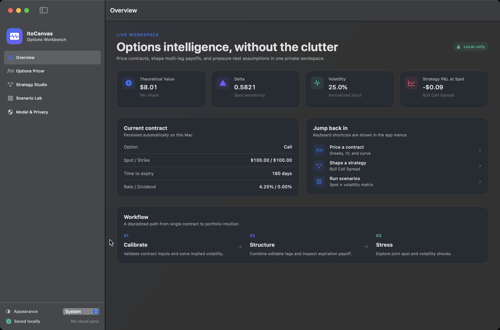
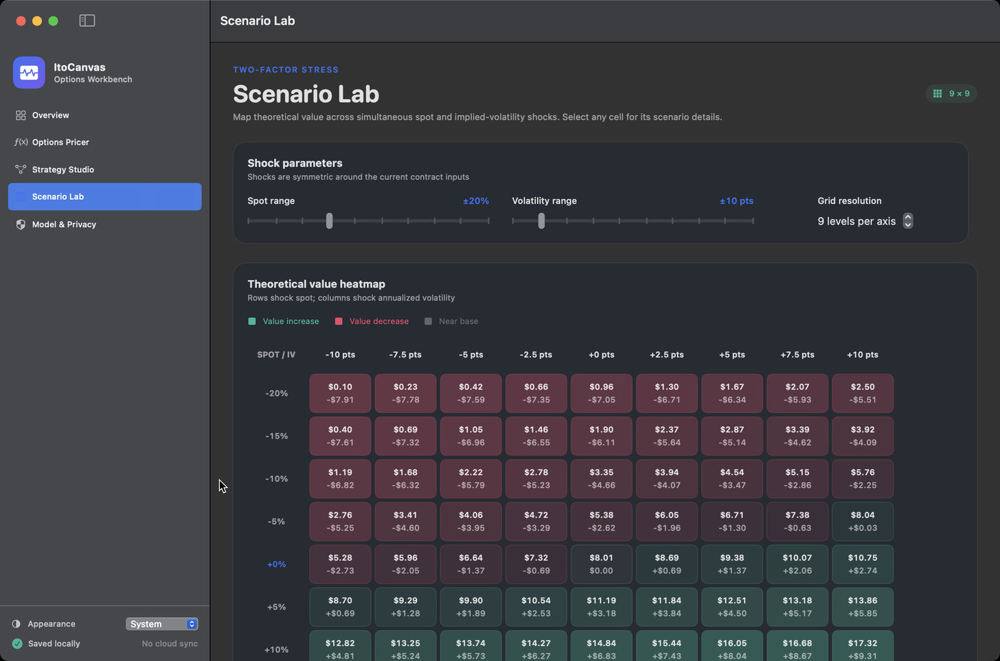

# ItoCanvas

[](https://github.com/zhuhroscar-tech/ItoCanvas/actions/workflows/ci.yml)
[](https://github.com/zhuhroscar-tech/ItoCanvas/releases/latest)

[](LICENSE)

**A native, offline quantitative options laboratory for macOS.**



ItoCanvas helps students, interview candidates, and analysts move from formulas to intuition. Price European options with Black–Scholes–Merton, inspect Greeks, recover implied volatility, build multi-leg strategies, and explore spot/volatility scenarios in one focused Mac app.

[Download the latest release](https://github.com/zhuhroscar-tech/ItoCanvas/releases/latest) · [Model notes](Docs/MODEL_NOTES.md) · [Product documentation](Docs/PRODUCT.md)

<details>
<summary>See the Scenario Lab</summary>



</details>

## Highlights

- Native SwiftUI macOS interface
- Black–Scholes–Merton pricing with continuous dividend yield
- Delta, gamma, vega, theta, and rho
- Bounded implied-volatility solver with no-arbitrage validation
- Spot × volatility scenario heatmap
- Multi-leg option strategy payoff analysis
- Strategy presets and custom legs
- Local workspace persistence and CSV export
- Light/dark mode, keyboard navigation, and VoiceOver labels
- Offline-first: no account, analytics, tracking, or network dependency

## Requirements

- macOS 14 Sonoma or later
- Xcode 26 or another toolchain with Swift 6.2 or later to build from source

## Build and test

```bash
swift test
./Scripts/build_app.sh
./Scripts/create_dmg.sh
```

Artifacts are written to `dist/`.

## Install

1. Open `ItoCanvas.dmg`.
2. Drag **ItoCanvas** into **Applications**.
3. Launch ItoCanvas from Applications.

The development DMG is ad-hoc signed. A public commercial release should be signed with an Apple Developer ID certificate and notarized before distribution outside GitHub.

## Quantitative conventions

- European exercise
- Lognormal Black–Scholes–Merton dynamics
- Continuously compounded risk-free and dividend rates
- Volatility and rate inputs shown as annualized percentages in the UI
- Vega and rho displayed per one percentage-point move
- Theta displayed per calendar day

ItoCanvas is an educational and analytical tool, not investment advice. Model outputs depend on assumptions and inputs and may differ from market prices.

## Architecture

- `Sources/ItoCanvasCore` — deterministic quantitative engine and value types
- `Sources/ItoCanvas` — SwiftUI app, state, persistence, and export
- `Tests/ItoCanvasCoreTests` — numerical and strategy tests
- `Scripts` — repeatable app-bundle and DMG packaging
- `Docs` — product and release documentation

## Privacy

See [PRIVACY.md](PRIVACY.md). ItoCanvas v1 does not transmit user data.

## License

MIT © 2026 Oscar Zhu
